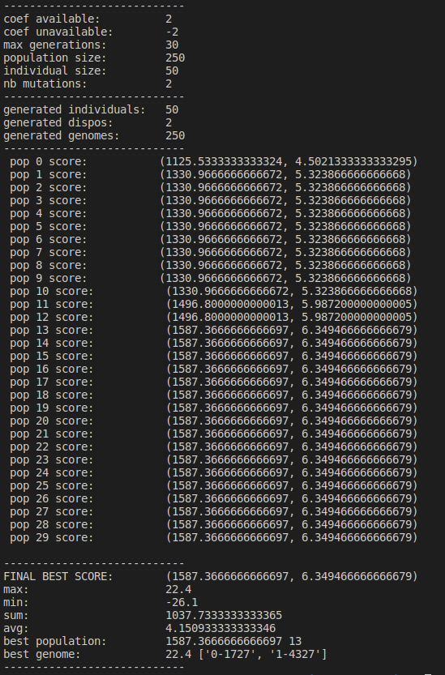

# Nurse scheduling and Genetic Algorithm.

## An attempt..

```python
# 1. instantiate algorithm
ga = GA(max_generations=35)

# 2. get almost feasible blocks and individuals from random generation
ga.set_random_datas()

# 3. run the evolution
ga.run()
```

```bash
python main.py
```

## Output

